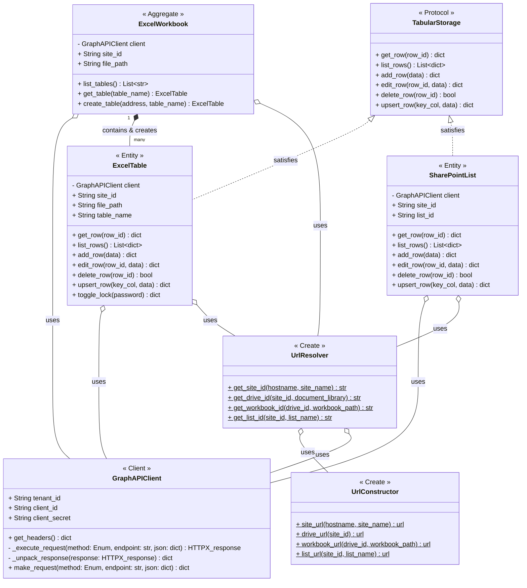

```mermaid

classDiagram

    class GraphAPIClient {
        << Client >>
        + String tenant_id
        + String client_id
        + String client_secret
        + get_headers() dict
        - _execute_request(method: Enum, endpoint: str, json: dict) HTTPX_response
        - _unpack_response(response: HTTPX_response) dict
        + make_request(method: Enum, endpoint: str, json: dict) dict
    }

    class TabularStorage {
        << Protocol >>
        + get_row(row_id) dict
        + list_rows() List~dict~
        + add_row(data) dict
        + edit_row(row_id, data) dict
        + delete_row(row_id) bool
        + upsert_row(key_col, data) dict
    }

    class UrlConstructor {
        << Create >>
        + site_url(hostname, site_name)$ url
        + drive_url(site_id)$ url
        + workbook_url(drive_id, workbook_path)$ url
        + list_url(site_id, list_name)$ url
    }

    class UrlResolver {
        << Create >>
        + get_site_id(hostname, site_name)$ str
        + get_drive_id(site_id, document_library)$ str
        + get_workbook_id(drive_id, workbook_path)$ str
        + get_list_id(site_id, list_name)$ str
    }

    class ExcelWorkbook {
        << Aggregate >>
        - GraphAPIClient client
        + String site_id
        + String file_path
        + list_tables() List~str~
        + get_table(table_name) ExcelTable
        + create_table(address, table_name) ExcelTable
    }

    class ExcelTable {
        << Entity >>
        - GraphAPIClient client
        + String site_id
        + String file_path
        + String table_name
        + get_row(row_id) dict
        + list_rows() List~dict~
        + add_row(data) dict
        + edit_row(row_id, data) dict
        + delete_row(row_id) bool
        + upsert_row(key_col, data) dict
        + toggle_lock(password) dict
    }

    class SharePointList {
        << Entity >>
        - GraphAPIClient client
        + String site_id
        + String list_id
        + get_row(row_id) dict
        + list_rows() List~dict~
        + add_row(data) dict
        + edit_row(row_id, data) dict
        + delete_row(row_id) bool
        + upsert_row(key_col, data) dict
    }

    %% TabularStorage implementations
    TabularStorage <|.. ExcelTable : satisfies
    TabularStorage <|.. SharePointList : satisfies

    %% Composition / Dependencies
    ExcelWorkbook o-- GraphAPIClient : uses
    ExcelWorkbook "1" *-- "many" ExcelTable : contains & creates
    ExcelTable o-- GraphAPIClient : uses
    SharePointList o-- GraphAPIClient : uses

    UrlResolver o-- UrlConstructor : uses
    UrlResolver o-- GraphAPIClient : uses
    ExcelWorkbook o-- UrlResolver : uses
    ExcelTable o-- UrlResolver : uses
    SharePointList o-- UrlResolver : uses
```