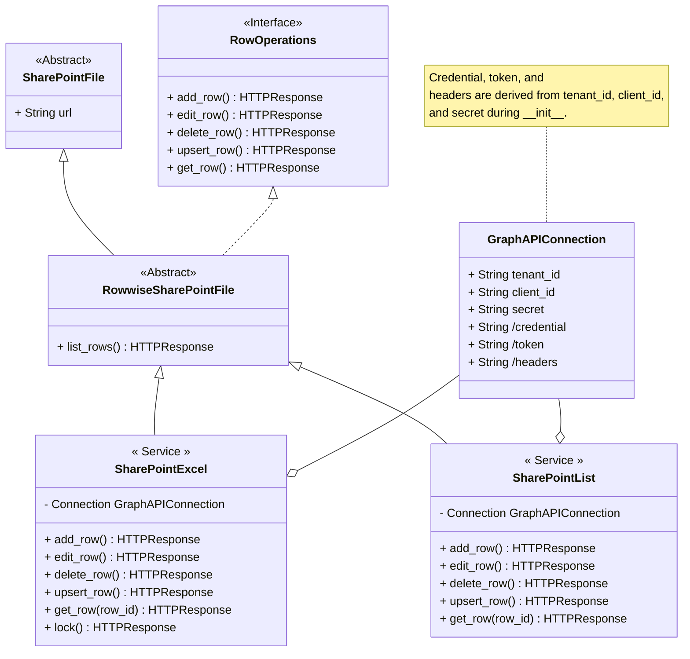

```mermaid

classDiagram
    class GraphAPIConnection {
        + String tenant_id
        + String client_id
        + String secret
        + String /credential
        + String /token
        + String /headers
    }
    note for GraphAPIConnection "Credential, token, and
    headers are derived from tenant_id, client_id, 
    and secret during \_\_init\_\_."

    class SharePointFile {
        <<Abstract>>
        + String url
    }

    class RowwiseSharePointFile {
        <<Abstract>>
        + list_rows() HTTPResponse
    }

    class RowOperations {
        <<Interface>>
        + add_row() HTTPResponse
        + edit_row() HTTPResponse
        + delete_row() HTTPResponse
        + upsert_row() HTTPResponse
        + get_row() HTTPResponse
    }


    class SharePointExcel {
        << Service >>
        - Connection GraphAPIConnection
        + add_row() HTTPResponse
        + edit_row() HTTPResponse
        + delete_row() HTTPResponse
        + upsert_row() HTTPResponse
        + get_row(row_id) HTTPResponse
        + lock() HTTPResponse
    }


    class SharePointList {
        << Service >>
        - Connection GraphAPIConnection
        + add_row() HTTPResponse
        + edit_row() HTTPResponse
        + delete_row() HTTPResponse
        + upsert_row() HTTPResponse
        + get_row(row_id) HTTPResponse
        }
    
    %% RowwiseSharePointFile inherits SharePointFile
    %% RowwiseSharePointFile implements RowOperations
    SharePointFile <|-- RowwiseSharePointFile
    RowOperations <|.. RowwiseSharePointFile


    %% Excel and List objects implement methods
    RowwiseSharePointFile <|-- SharePointExcel
    RowwiseSharePointFile <|-- SharePointList

    %% Excel and List objects have a GraphAPIConnection
    GraphAPIConnection --o SharePointExcel
    GraphAPIConnection --o SharePointList
```