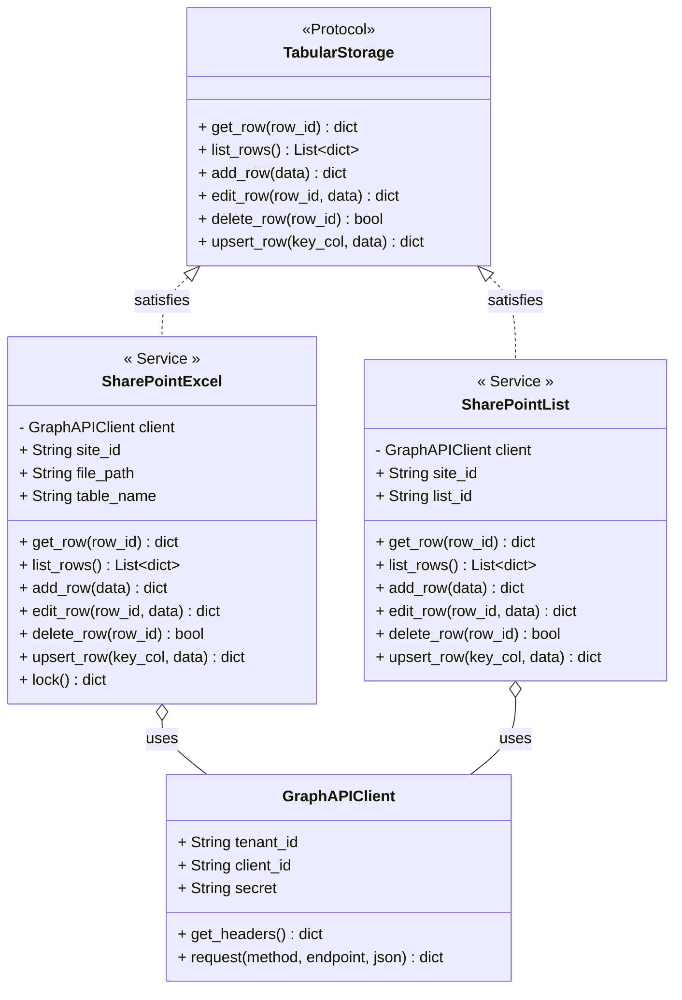

```mermaid

classDiagram

    class GraphAPIClient {
        + String tenant_id
        + String client_id
        + String secret
        + get_headers() dict
        + request(method, endpoint, json) dict
    }

    class TabularStorage {
        <<Protocol>>
        + get_row(row_id) dict
        + list_rows() List~dict~
        + add_row(data) dict
        + edit_row(row_id, data) dict
        + delete_row(row_id) bool
        + upsert_row(key_col, data) dict
    }

        class SharePointExcel {
        << Service >>
        - GraphAPIClient client
        + String site_id
        + String file_path
        + String table_name
        + get_row(row_id) dict
        + list_rows() List~dict~
        + add_row(data) dict
        + edit_row(row_id, data) dict
        + delete_row(row_id) bool
        + upsert_row(key_col, data) dict
        + lock() dict
    }

    class SharePointList {
        << Service >>
        - GraphAPIClient client
        + String site_id
        + String list_id
        + get_row(row_id) dict
        + list_rows() List~dict~
        + add_row(data) dict
        + edit_row(row_id, data) dict
        + delete_row(row_id) bool
        + upsert_row(key_col, data) dict
    }

    %% Excel and List objects implement methods
    TabularStorage <|.. SharePointExcel : satisfies
    TabularStorage <|.. SharePointList : satisfies

    %% Excel and List objects have a GraphAPIConnection
    SharePointExcel o-- GraphAPIClient : uses
    SharePointList o-- GraphAPIClient : uses
```